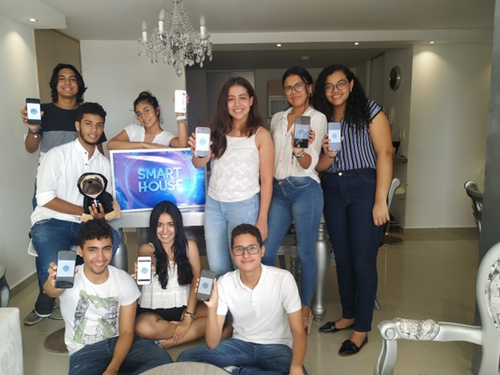

# 🏡 Smart House for Accessibility

A large-scale **Smart House project** controlled via an **Android mobile application**.  
This project was developed in **Android Studio** by first-year **Software Engineering students** as part of an academic competition, where it won **1st place**.  

---

## 📖 Project Overview
The Smart House was designed with the vision of improving accessibility and independence for **elderly people** and individuals with **disabilities**.  

The system works through **Bluetooth communication** between the Android application and the devices in the house. It not only demonstrates mobile development but also integrates **hardware, electrical, and civil engineering** aspects to achieve a complete, functional smart home.

---

## 🔑 Key Features
- 📱 **Android Mobile App** (built in Android Studio)  
- 🔌 **Bluetooth connectivity** with Arduino modules  
- 💡 Control of electrical devices and appliances via the app  
- 🛠️ Integration of **Arduino boards** and modification of device electrical systems  
- 🏗️ **Civil Engineering contribution**: house design and construction  
- 💰 **Budget management** and project planning handled by students  
- 👩‍🔧 **Multidisciplinary teamwork** with 20 engineering students from various fields  

---

## 🏆 Achievements
- 🥇 **First Place** in the competition for innovation and social impact  
- 🎯 Designed to **support elderly people and individuals with disabilities**  
- 🤝 A true **collaborative effort** across Software, Electronics, Electrical, and Civil Engineering

### 📰 Press Coverage
Our project was featured in the official news article by Universidad del Norte:  

👉 [Read the article Geo Expo Física](https://www.uninorte.edu.co/web/grupo-prensa/w/los-proyectos-galardonados-de-la-septima-edicion-de-geo-expo-fisica)

---

## ⚙️ Tech Stack
- **Mobile Development:** Android Studio (Java)  
- **Hardware:** Arduino boards, sensors, and relays  
- **Communication Protocol:** Bluetooth  
- **Construction:** Civil Engineering team for structural design and build  

---

## 📸 Gallery

### Application

### House Prototype

### Team

---

## 🎥 Demo Video

*(Click the image above to watch the demo )*

---

## 👩‍🎓 Team
A project developed by **20 students** from different engineering fields, including:  
- Software Engineering  
- Electronics Engineering  
- Electrical Engineering  
- Civil Engineering  

---

## 🙌 Acknowledgments
We dedicate this project to improving lives and accessibility.  
Special thanks to all the professors and mentors who guided us through the process.  

## License

[MIT](https://choosealicense.com/licenses/mit/)

https://uninorte-my.sharepoint.com/:v:/g/personal/montanoam_uninorte_edu_co/EfLkLYzkCR1a8W4PD6xaB8EBM-hgGSjiwIeayxFeGmeV3A?e=S1AOZj
